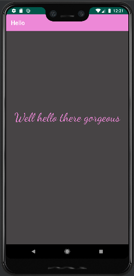

# Rapport

**Skriv din rapport här!**
Det som har gjorts vid denna uppgift är att skapa en Github account och förstå hur det fungerar, ladda ner och få igång Androidstudios och koppla de två samman.
En annan sak som gjorts är att skapa och få igång en mobil-emulator. När alla delar fungerar var det dags att hitta i de olika filerna. Jag kom fram till att ändringarna skedde i activity_main.xml. Där hittades kodraden som skrev ut 'Hello' som då hämtade ordet ifrån appens namn. Nu står det istället 'Hello there gorgeous', bakgrunden är grå, texten är i rosa och något större.  
    

```
    <TextView
        ...
        android:text="Well hello there gorgeous"
        android:textColor="#ED88D7"
        android:textSize="40sp"
        ...
    />
```
Figur 1: Kod där 'Hello' är ändrad till 'Well hello there gorgeous', får sin rosa färg och en större storlek.

```
    <androidx.constraintlayout.widget.ConstraintLayout xmlns:android="http://schemas.android.com/apk/res/android"
        ...
        android:background="#474445"
        ...
    >
```
Figur 2: Kod där bakgrunden får sin gråa färg.


